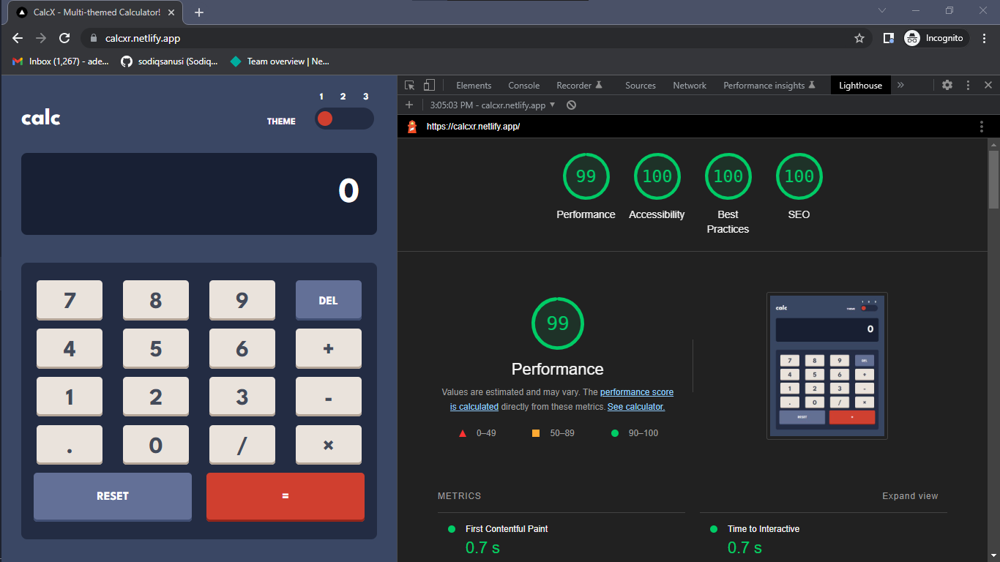

# CalcXR

## Table of contents

- [Overview](#overview)
  - [The challenge](#the-challenge)
  - [Screenshot](#screenshot)
  - [Links](#links)
- [My process](#my-process)
  - [Built with](#built-with)
  - [What I learned](#what-i-learned)
  - [Continued development](#continued-development)
  - [Useful resources](#useful-resources)
- [Author](#author)
- [Acknowledgments](#acknowledgments)

## Overview
The goal was to build a web app where users can perform basic mathematical operations, a calculator-like web application. The application must also have a multithemed concept, with the ability to switch between themes seamless and made easy as possible.

### The challenge
Users should be able to:

- View the optimal layout for the app depending on their device's screen size.
- See the size of the elements adjust based on their device's screen size..
- Perform mathematical operations like addition, subtraction, multiplication, and division
- Adjust the color theme based on their preference.
- [ ] Have their initial theme preference checked using `prefers-color-scheme` and have any additional changes saved in the browser _(optional)_ .

### Screenshot

### Links
- Solution URL: [https://github.com/sodiqsanusi/calculator/]()
- Live Site URL: [https://calcxr.netlify.app/]()

## My process
First time building an application with Next.js🥳! Even though this was a new framework, I still retained the process I use when building React applications.
Started with a hand-drawn wireframe that broke down all design elements to component-level stuff, setup my preferred CSS-in-JS tool which is styled-components, then eliminated most boilerplate code that came with the `create-next-app` command.

Built the interface without functionality using the mobile-first workflow in my approach, worked on improving accessibility by taking feedback from the Lighthouse tools, then worked on the main functionalities while making sure the already built interface didn't break by the addition of functionalities. 

### Built with
- CSS Grid
- Mobile-first workflow
- [Next.js](https://nextjs.org/) - React framework.
- [Styled Components](https://styled-components.com/) - CSS-in-JS solution for styling dynamic content.

### What I learned
Wheew! Learnt a lot during the creation of this app really. For the past two to three weeks, I had been working on my JavaScript algorithm skills, so the functionality aspect of the app wasn't really hard like that. New things I learnt:
- How to configure styled-components for Next.js applications.
- The effects of file structure of a JavaScript application and the best way to structure your application's content.

### Continued development
Okayy, things I want to get better at. In this project, I didn't get to fetch and use data on the application, so I'm planning to build something that will require data from an API maybe, will try practising Static Site Generation, Server Side Rendering and Incremental Static Regeneration with said app, fingers crossed🤞🏾.

Also want to try collaborating with someone or a group of people on a project. I understand that building apps with different people comes with its own challenges and I want to familiarize myself with that early on.

### Useful resources
- [Eval() vs Function() in JavaScript](https://www.educative.io/answers/eval-vs-function-in-javascript) - Had to convert strings to a mathematical expression in the app, and I had seen it somewhere that `eval()` shouldn't be used as it could open up a lot of security issues. Was looking for an alternative and this article along with the MDN Docs for `Function()` helped me out. Recommended for a situation like mine👍🏾.
- [Creating a custom scrollbar - W3Schools](https://www.w3schools.com/howto/howto_css_custom_scrollbar.asp) - Though you might not see it, there is a part of the app where I made a custom scrollbar for overflowing content🙃, W3Schools was helpful as always in helping to explain things. 

## Author
- Twitter - [@sodiqsanusi0](https://www.twitter.com/sodiqsanusi0)
- LinkedIn - [Sodiq Sanusi](https://www.linkedin.com/in/sodiqsanusi0)

## Acknowledgments
To freeCodeCamp for helping me with algorithms and data structures👏🏾 and the FrontendMentor team for the designs of this web application.

**PS:** There is a PDF file in this directory that shows the lighthouse metrics in detail.
